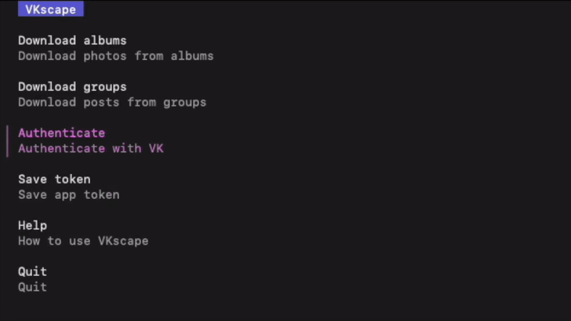

# VKscape

<p>

</p>

VKscape is a CLI/TUI tool for downloading your VK archive — the stuff you can’t easily export via the official tools. It supports downloading photos from albums and posts from groups.

Downloaded data will be located in the `vkscape_output` folder in the current working directory.

[Installable](#installation) using `homebrew tap` or `go install`.



## Installation

### Homebrew (tap)

```
brew tap yellalena/tap
brew install vkscape
```

### Go install

```
go install github.com/yellalena/vkscape@latest
```

## Usage

- Run `vkscape` with no arguments to launch the TUI (screenshot above).
- Use subcommands (e.g. `vkscape auth`, `vkscape albums`, `vkscape groups`) or `--help` to use the CLI.

## Authentication

VKscape supports two authentication methods:

1) App token (`--token`)
- Use a pre-generated app token ([service token](https://id.vk.com/about/business/go/docs/ru/vkid/latest/vk-id/connection/tokens/service-token)).
- Works for public content only.
- Private albums and private profiles are not accessible.

2) User auth (`--user`)
- Uses a browser-based OAuth flow with [VK ID](https://id.vk.com/about/business/go/docs/ru/vkid/latest/vk-id/intro/start-page).
- Lets you access your own private content (albums, etc.).

## Available commands

`vkscape auth`
- Authenticate with VK using either an app token or the user OAuth flow.

`vkscape albums`
- Download photos from albums by owner ID and optional album IDs.
  - if album IDs are not provided, all available owner's albums will be downloaded.

`vkscape groups`
- Download posts from groups by IDs or handles.
  - note that group IDs should be a negative integer ([reference](https://dev.vk.com/ru/method/wall.post#%D0%9F%D0%B0%D1%80%D0%B0%D0%BC%D0%B5%D1%82%D1%80%D1%8B))


## What’s next

- Specifying output location
- Saving output to archive
- Saving more metadata for downloaded content
- More commands

## Feedback

I'd love to hear your thoughts, questions or ideas on this project. 
See my contacts at [Linktree](https://linktr.ee/heyaliona).

## Built with

- [Cobra](https://github.com/spf13/cobra) for CLI
- [Bubble Tea](https://github.com/charmbracelet/bubbletea) for TUI
- [VK SDK](https://github.com/SevereCloud/vksdk) for VK API
